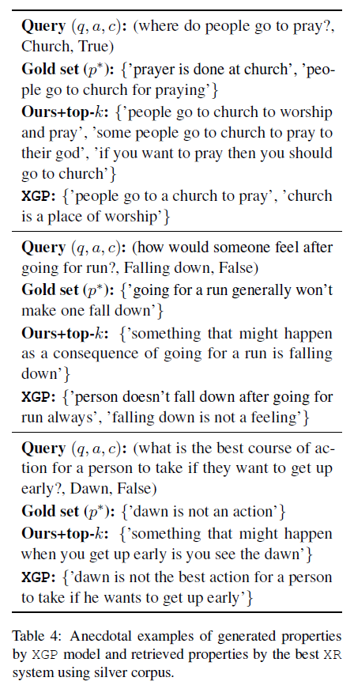

# Explanations for CommonsenseQA: Code And Models

This repository contains the publicly released code for the experimentation section of the Explanations for CommonsenseQA paper, presented at ACL-IJCNLP 2021. There are two subdirectories, ```retrieval``` and ```generation```, corresponding to the Section 5 and Section 6 respectively, in our ACL paper. These two sections have their separate ReadMe files intructing on how to train and run inference with trained models.

We release the complete annotated dataset, the id mappings for the train, test and validation split used in our experiments, at [https://github.com/dair-iitd/ECQA-Dataset/](https://github.com/dair-iitd/ECQA-Dataset/). Please follow the instructions mentioned there to glue up our annotations with the CQA data.



## Prerequisites

First follow the data preprocessing steps given at [our dataset repository](https://github.com/dair-iitd/ECQA-Dataset/), to glue our annotations with the [CommonsenseQA data](https://www.tau-nlp.org/commonsenseqa), to finally obtain the following files -
```
cqa_data.csv
cqa_data_train.csv
cqa_data_val.csv
cqa_data_test.csv
```

Copy all of these files at ```retrieval/data/```.

For running our code, you will need to install some python packages. It's recommended to first setup a ```python3.7``` virtual environment for these. You can run the following command to install the required packages -

```bash
pip3 install -r requirements.txt
```

Now you can head over to the [retrieval section](https://github.com/dair-iitd/ECQA/tree/master/retrieval) or [generation section](https://github.com/dair-iitd/ECQA/tree/master/generation) to perform our experiments with this data.


## Trained Models

We public release the models we trained using the training scripts, to report the numbers published in our ACL papers [here at Zenodo](https://zenodo.org/record/4784281).

The above release contains 5 zip files, having the following filename to model mapping -
* 'xgf1.zip' : XGF-I
* 'xgf2.zip' : XGF-II
* 'xgp.zip' : XGP
* 'xgpw.zip' : XGP-W
* 'SBERT.zip' : Deep Property Ranker

Note that these zip files need to be unzipped and the result content directory needs to be used at the time of inference using our provided inference scripts.

## Citations
Please consider citing this paper if you use the code or models:
```
@inproceedings{aggarwaletal2021ecqa,
  title={{E}xplanations for {C}ommonsense{QA}: {N}ew {D}ataset and {M}odels},
  author={Shourya Aggarwal and Divyanshu Mandowara and Vishwajeet Agrawal and Dinesh Khandelwal and Parag Singla and Dinesh Garg},
  booktitle="Proceedings of the 59th Annual Meeting of the Association for Computational Linguistics and the 11th International Joint Conference on Natural Language Processing (Volume 1: Long Papers)}",
  year = "2021",
  publisher = "Association for Computational Linguistics"
}
```

## License
[Apache-2.0 License](https://www.apache.org/licenses/LICENSE-2.0)
